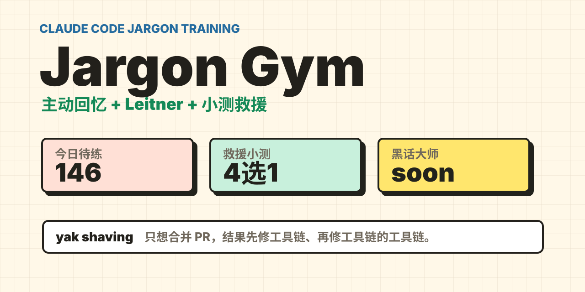

# Jargon Gym



**A tiny, unserious web app for memorizing very serious engineering jargon.**

Jargon Gym turns a Claude Code-style glossary into a flashcard trainer with active recall, Leitner spaced repetition, and instant rescue quizzes for the terms your brain rage-quits on.

If you have ever nodded confidently at `yak shaving`, `dogfooding`, `bus factor`, or `shadow traffic` while secretly thinking "I should know what that means by now", this is your training room.

## Why

Engineering jargon is useful, but it also sounds like a group chat that got promoted to architecture review:

- `dogfooding` — eating your own dog food, except somehow this means "use your own product first".
- `yak shaving` — you only wanted to merge a PR; now you are rebuilding your toolchain's emotional support system.
- `bikeshedding` — nobody questions the reactor, everyone fights about the bike shed color.
- `bus factor` — a project risk metric with surprisingly aggressive urban planning energy.
- `footgun` — an API so sharp it files the incident report for you.
- `spaghetti code` / `lasagna code` — software architecture, now with carbs.
- `heisenbug` — the bug that vanishes when you look at it, because apparently debugging needed philosophy.
- `nuke` — the technical term for "delete it with confidence and maybe regret".

This project is deliberately lighthearted, but the learning loop is real:

1. Select a jargon library.
2. Try to recall the meaning before seeing the answer.
3. Reveal the answer and rate your recall.
4. Forgotten or fuzzy cards enter an immediate multiple-choice quiz.
5. Correctly reinforced cards return later through a Leitner schedule.

## Features

- **Markdown-powered glossary**: the card deck is parsed from `docs/claude-code-jargon-glossary.md`.
- **Library selection**: study one category at a time, such as testing, debugging, deployment, or Claude Code/Git terms.
- **Active recall first**: answers are hidden until you choose to reveal them.
- **Direct rescue mode**: if a term is blank in your head, send it straight to a quiz.
- **Leitner spaced repetition**: cards move through five boxes based on recall quality.
- **Instant reinforcement quizzes**: `again` and `hard` cards become four-choice tests.
- **Local JSON progress**: no database, no account, no cloud dependency.
- **Light comic UI**: designed to feel like an office jargon gym, not a serious enterprise dashboard.

## Demo Flow

```text
Pick library
  -> Recall term
  -> Reveal answer
  -> Rate memory
  -> Quiz weak cards
  -> Repeat later
```

## Quick Start

This project uses `uv`.

```bash
uv run flask --app jargongym.app run --debug --port 5001
```

Open:

```text
http://127.0.0.1:5001
```

Run tests:

```bash
uv run python -m pytest -v
```

## Project Structure

```text
jargongym/
  app.py       # Flask routes and page flow
  cards.py     # Markdown glossary parser
  leitner.py   # spaced repetition logic
  quiz.py      # four-choice reinforcement quiz
  store.py     # local JSON progress store

docs/
  claude-code-jargon-glossary.md

templates/
  index.html
  quiz.html

static/
  styles.css
```

## Data

- Source glossary: `docs/claude-code-jargon-glossary.md`
- Local progress: `data/progress.json`

The app does not modify the source glossary.

## Roadmap Ideas

- Add typed-answer mode instead of only multiple choice.
- Add daily review limits and session summaries.
- Add import/export for custom company jargon.
- Add a "meeting survival mode" for the most cursed terms.
- Add a shareable progress card for social posting.

## License

MIT

