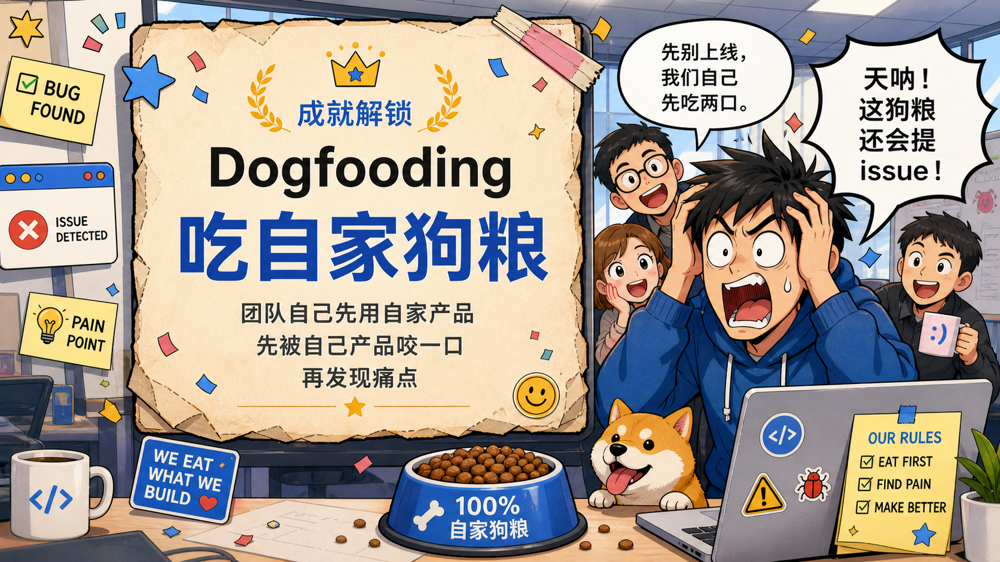
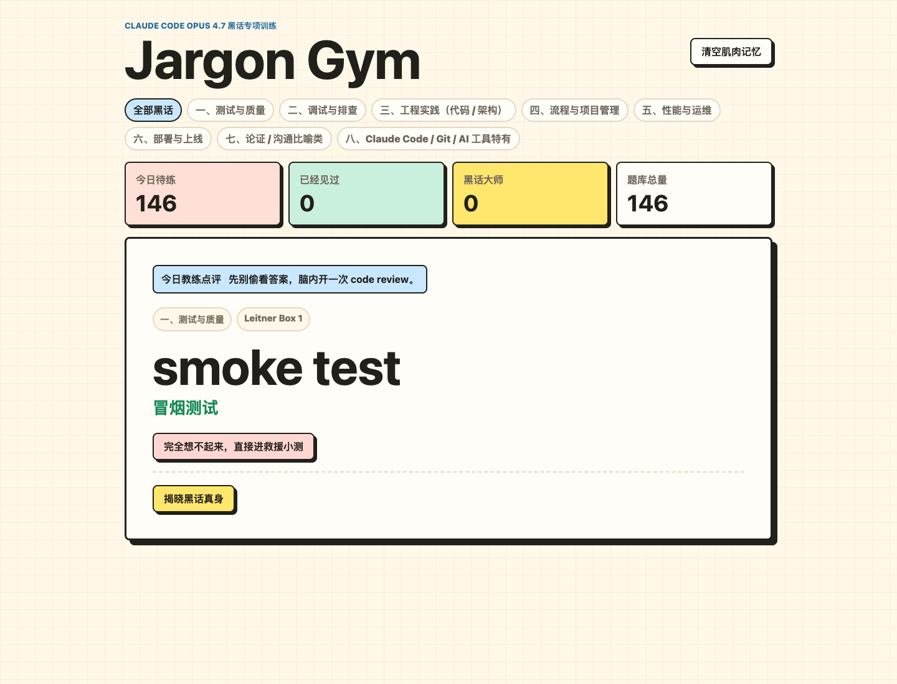

# Jargon Gym 黑话健身房

[English](README.en.md) | 中文



一个不太严肃、但真的能帮你背 **Claude Code** 工程黑话的本地网页应用。

Jargon Gym 会把 **Claude Code** 风格的黑话词典变成一个背诵训练器：先主动回忆，再揭晓答案，再用 Leitner 间隔重复和即时小测把“刚刚还会、转头就忘”的词重新捞回来。

如果你曾经在 **Claude Code** 语境里听到 `yak shaving`、`dogfooding`、`bus factor`、`shadow traffic` 的时候认真点头，但心里想的是“我是不是应该早就知道这个词是什么意思”，那这里就是你的黑话训练台。

## 项目定位

Jargon Gym 是一个 **local-first** 的本地学习小工具：默认在自己的电脑上启动、自己使用、自己保存进度，不需要部署成公网服务，也不需要账号系统。

这个版本的定位就是一个娱乐 demo，到这里基本就可以收工了。项目公开出来，主要是方便感兴趣的开发者 fork 后继续整活，比如改成手机端、Mac 端或桌面端应用。

## 界面预览



## 为什么做这个

**Claude Code** 的工程黑话有时真的有用，但它们听起来也很像一个群聊被强行晋升成了架构评审。尤其是 **Claude Code Opus 4.7** 发布后，黑话密度仿佛突然加了杠杆，记不住不是你的问题，是词库先动的手：

- `dogfooding` / 吃自家狗粮：不是宠物食品测评，而是团队自己先用自家产品，先被自己产品咬一口，再发现痛点。
- `yak shaving` / 剃牦牛：你只是想合并一个 PR，结果先修工具链，再修工具链的工具链。
- `bikeshedding` / 自行车棚效应：没人质疑反应堆设计，大家为自行车棚颜色吵到天亮。
- `bus factor` / 公交车系数：一个项目风险指标，但语气像城市交通事故模拟器。
- `footgun` / 坑脚枪：一个 API 贴心到会帮你自己开事故单。
- `spaghetti code` / `lasagna code`：软件架构，主打碳水化合物。
- `heisenbug` / 海森堡 bug：你一看它就消失，调试从此带上哲学意味。
- `nuke` / 核平：技术语境里的“删了吧，先自信，后后悔”。

这个项目的气质是轻松搞笑的，但背诵流程是认真设计过的：

1. 选择一个黑话词库。
2. 先看题面，尝试主动回忆。
3. 揭晓答案，并给自己的回忆质量打分。
4. 忘记或模糊的卡片进入即时四选一小测。
5. 通过小测强化后的卡片，再按 Leitner 间隔重复安排复习。

## 功能

- **Markdown 词典驱动**：题库从 `docs/claude-code-jargon-glossary.md` 自动解析。
- **词库选择**：可以只背测试、调试、部署、**Claude Code** / Git 等某一类黑话。
- **主动回忆优先**：答案默认遮盖，不先偷看。
- **救援模式**：完全想不起来时，可以直接进入小测。
- **Leitner 间隔重复**：根据记忆质量推进五箱制复习。
- **即时强化小测**：`完全忘了` 和 `有点眼熟` 的卡片会进入四选一测试。
- **本地 JSON 记忆系统**：不用数据库、不用账号、不依赖云端，关掉本地服务器后进度仍然保留。
- **浅色搞笑 UI**：更像办公室黑话健身房，而不是严肃企业后台。

## 学习流程

```text
选择词库
  -> 主动回忆
  -> 揭晓答案
  -> 评价记忆
  -> 弱项小测
  -> 间隔复习
```

## 快速开始

本项目使用 `uv`。

```bash
uv run flask --app jargongym.app run --debug --port 5001
```

打开：

```text
http://127.0.0.1:5001
```

运行测试：

```bash
uv run python -m pytest -v
```

## 项目结构

```text
jargongym/
  app.py       # Flask routes and page flow
  cards.py     # Markdown glossary parser
  leitner.py   # spaced repetition logic
  quiz.py      # four-choice reinforcement quiz
  store.py     # local JSON progress store

docs/
  claude-code-jargon-glossary.md

templates/
  index.html
  quiz.html

static/
  styles.css
```

## 数据

- 原始词典：`docs/claude-code-jargon-glossary.md`
- 本地进度：`data/progress.json`

应用不会修改原始词典。

`data/progress.json` 是本地记忆系统：它会记录每张卡片所在的 Leitner Box、下次复习时间、复习次数、上次评分和上次复习时间。关闭本地服务器只会停止网页进程，不会清空这个文件；下次重新启动后，应用会继续读取昨天的背诵进度。

如果想重新开始，可以在界面里点击“清空肌肉记忆”，或者手动删除 `data/progress.json`。该文件已被 `.gitignore` 忽略，不会随着项目发布到 GitHub。

## 后续整活方向

下面不是正式路线图，只是留给其他开发者 fork 后继续玩的方向：

- 封装成手机端 Web/PWA、Mac 端应用，或 Windows/Linux 桌面端应用。
- 用 Tauri、Electron、PyInstaller 或原生移动端技术做更完整的客户端。
- 增加拼写/输入答案模式，而不只是四选一。
- 增加每日复习上限和学习总结。
- 支持导入/导出自定义公司黑话。
- 增加“会议求生模式”，专练最容易在会上听懵的词。
- 生成可分享的学习进度卡片。

## 许可证

MIT
